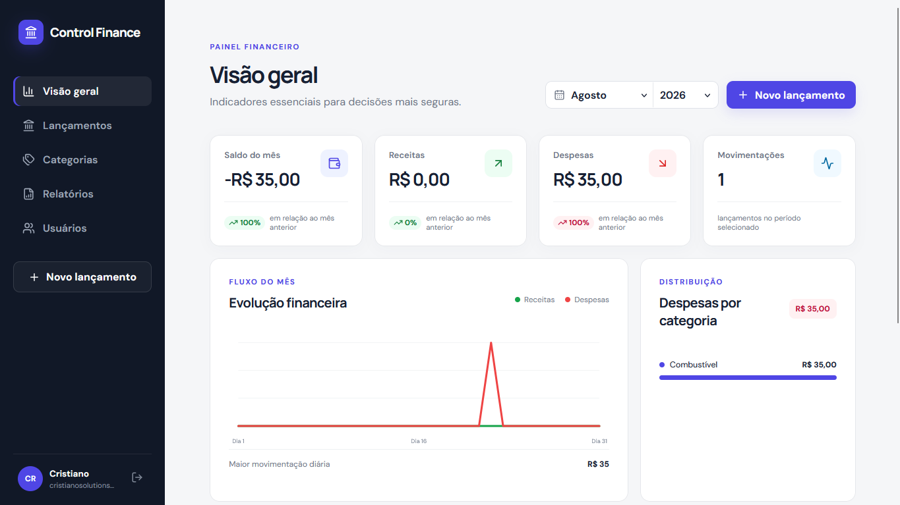
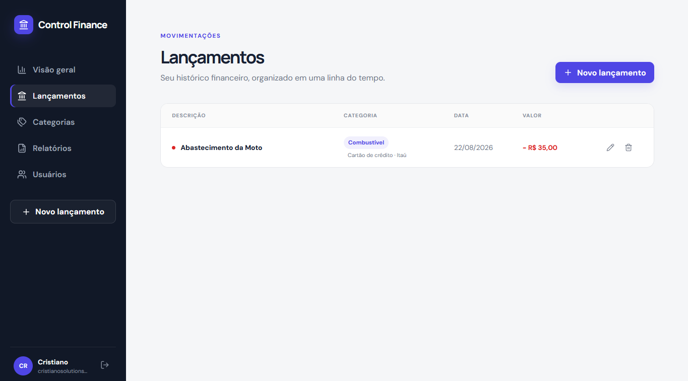
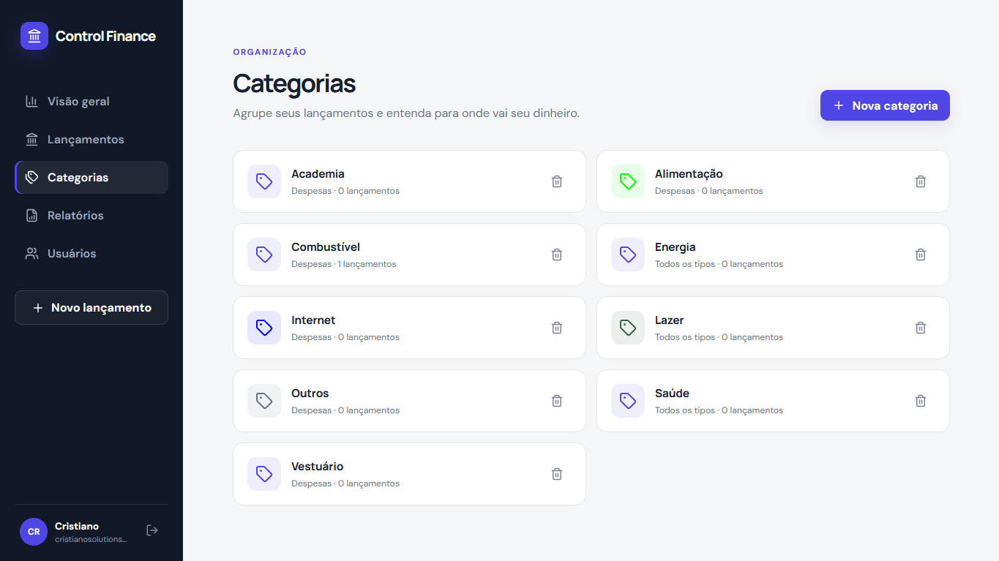
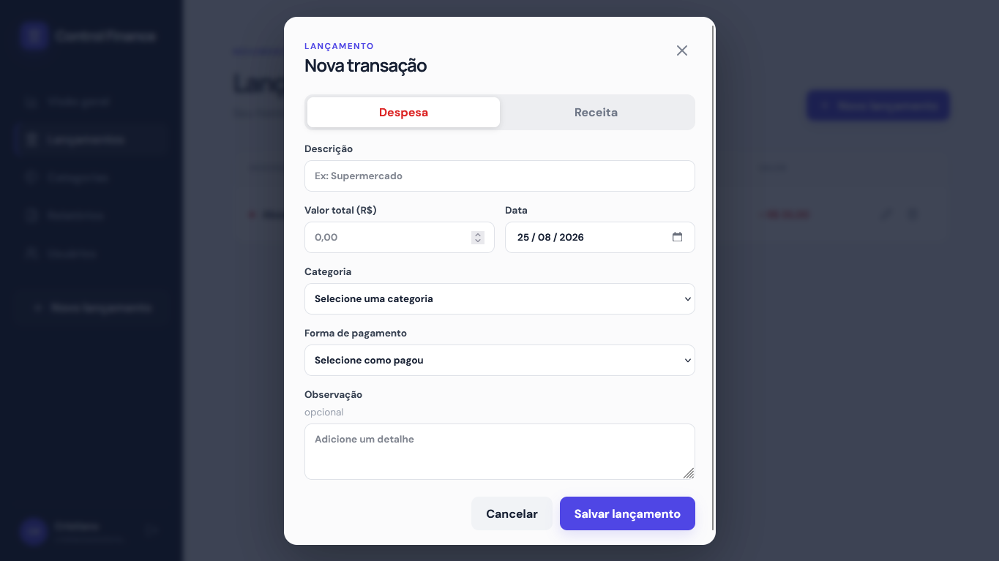
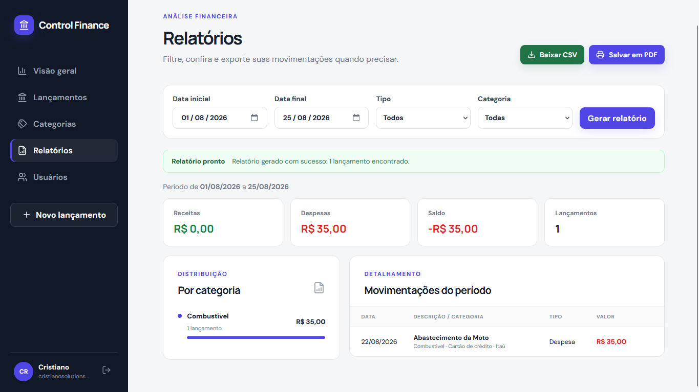
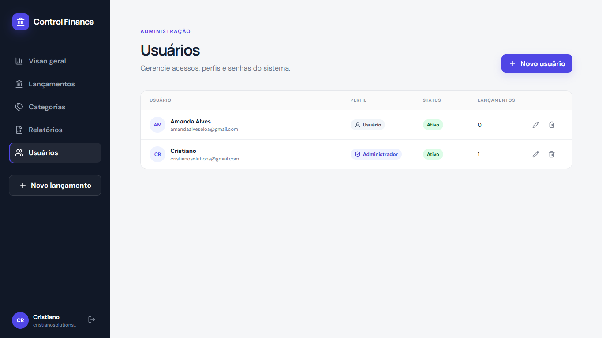
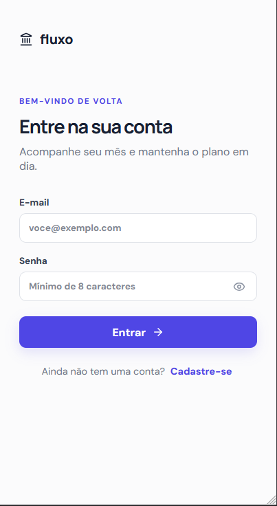

# Control Finance

### Controle financeiro pessoal, simples e visual

Organize receitas e despesas, acompanhe seu saldo e entenda para onde seu dinheiro está indo.

## Sobre a aplicação

O **Control Finance** ajuda a organizar as finanças pessoais em um só lugar. Cada usuário tem seu próprio cadastro, contas, categorias e movimentações. A interface se adapta ao computador, tablet e celular.

Os registros são feitos manualmente ou importados de uma planilha CSV. A aplicação não se conecta automaticamente a bancos ou administradoras de cartão.

## O que você pode fazer

- Registrar receitas e despesas e acompanhar o resumo de cada mês.
- Organizar contas e carteiras e transferir valores entre elas.
- Cadastrar cartões, acompanhar faturas e registrar compras parceladas.
- Criar categorias e compromissos recorrentes.
- Definir limites de gastos por categoria e metas de economia.
- Consultar previsões, relatórios e avisos de vencimentos.
- Importar lançamentos de CSV, anexar comprovantes e exportar relatórios.
- Gerenciar sua senha, foto de perfil e sessões de acesso.

## Comece por aqui

| Quero… | Onde encontrar |
| --- | --- |
| Entender como usar a aplicação | [Guia de uso](docs/GUIA_DE_USO.md) |
| Baixar e executar no meu computador | [Instalação local](docs/EXECUCAO_LOCAL.md) |
| Conhecer as ferramentas utilizadas | [Tecnologias](#tecnologias) |

## Interface

### Visão geral

<strong>Ver mais telas</strong>

### Login e cadastro

### Lançamentos

### Categorias

### Novo lançamento

### Relatórios

### Administração de usuários

### Versão mobile

  

## Tecnologias

| | Tecnologia | Uso no projeto |
|:---:|---|---|
|  | **React** | Componentes e interface do usuário |
|  | **TypeScript** | Tipagem do frontend e backend |
|  | **Vite** | Desenvolvimento e build do frontend |
|  | **Node.js** | Ambiente de execução da API |
|  | **Express** | Rotas e serviços HTTP |
|  | **Prisma ORM** | Modelagem, migrations e acesso aos dados |
|  | **PostgreSQL** | Banco de dados relacional |
|  | **Vitest** | Testes automatizados da API |

Outras bibliotecas importantes: **Zod**, **JWT**, **bcryptjs**, **Helmet**, **Lucide React**, **CORS** e **Supertest**.

## Executar no computador

Você pode executar a aplicação com **Docker Desktop** ou instalar **Node.js e PostgreSQL** separadamente. O [guia de instalação local](docs/EXECUCAO_LOCAL.md) explica as duas opções, desde o download até a criação da primeira conta.

Depois de iniciar, abra o endereço indicado no navegador, faça seu cadastro e siga o [guia de uso](docs/GUIA_DE_USO.md).

---

  Desenvolvido para tornar o acompanhamento financeiro mais claro e acessível.

